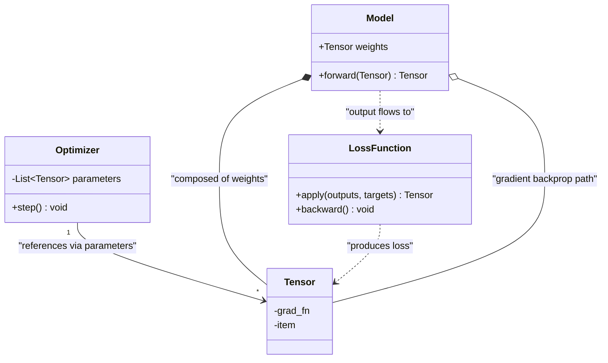
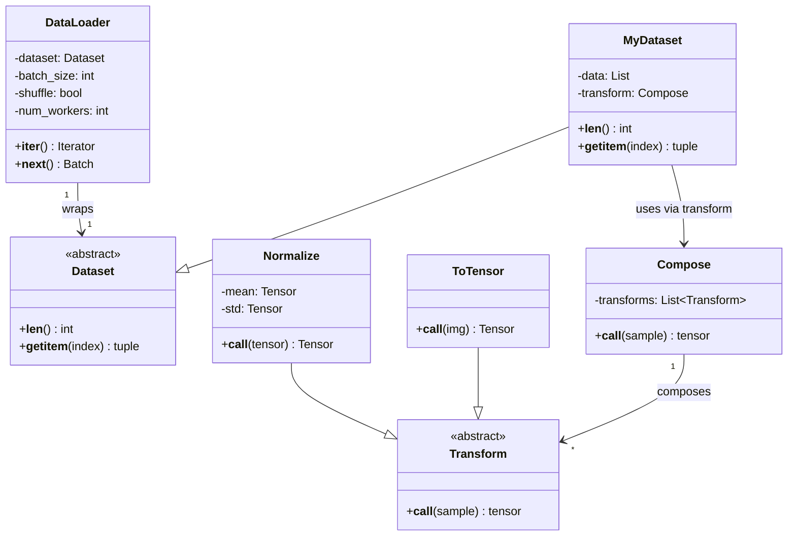

# Coursera PyTorch Specialization - Study Notes

https://www.coursera.org/programs/on-demand-courses-for-google-c4stl/professional-certificates/pytorch-for-deep-learning

## Basics of Data Processing, Model Setup, Training, and Autograd (takeaways from C1M1)

Simple ML tasks generally have 4 steps:

1. *Data preparation*, where we transforms a tabular data file, e.g. `pd.DataFrame` (e.g. of shape M by N+1, +1 is for target) into `torch.tensor` of same shape.
2. *Feature engineering*, where we widen `torch.tensor` to deduce additional features based on business context.
3. *Model architecting*, where we establish `nn.Sequential` by wiring several layers (e.g. `nn.Linear` and `nn.RelU`) to form a neuronetwork.
4. *Model training*, where we loop througn E epochs, each epoch runs over full training dataset, and each sample in the dataset is forward+backward propagated exactly once.

The end result is a learning curve after step 4, with exactly E points to plot. Each point is the *average* loss of all samples processed within that epoch.

Also note that step 3 produces 3 related objects:

1. The `model` object, of type `torch.nn.Sequential`, wraps various layers; think of it as a neuro network.
2. The `optimizer` object, e.g. `torch.optim.Adam(model.parameters(), lr=...)`. Crucially, the optimizer needs to be directly wired to the model parameters, because when training calls `optimizer.step()`, optimizer leverages this wiring to update the model parameters (weights).
3. The `loss_function` object, e.g. `torch.nn.MSELoss()`. This doesn't wire to model or optimizer at initialization, but during training, when we call `loss_function(model(features), targets)`, it establishes a computation graph which indirectly gets wired to the outputs of the model and therefore wired to the model parameters. This then allows the loss function to compute gradients (aka autograd), and store them in memory in the model's parameters.

End-to-end pseudo code of training:

```python
def train(training_features, training_targets):
    '''
    training_features: Float[Tensor, "m n"] input training featuress
    training_targets: Float[Tensor, "m"], output training targets
    '''
    model, optimizer, loss_fcn = initialize_model()
    losses: list[float] = []  # for plotting
    for _ in range(NUM_EPOCHS):
        # Note this is crucial to avoid optimizer from updating
        # weights with accumulated gradients. We almost always want
        # to do this.
        optimizer.zero_grad()

        outputs = model(training_features)
        loss = loss_fcn(outputs, training_targets)
        loss.backward()
        optimizer.step()

        losses.append(loss.item())
```

Side note: `loss` is a `tensor` object. Each tensor has a `.grad_fn` attribte that points to the operation that created it, which forms an implicit chain of computation graph. Autograd leverages this structure to backprop and update gradients for each tensor in the model weights.

```
loss_tensor
  ├─ .grad_fn → MSELoss operation
      ├─ inputs: [model_output, target]
      │   ├─ model_output.grad_fn → Linear operation
      │   │   ├─ inputs: [previous_layer_output, weights, bias]
      │   │   │   ├─ weights.grad_fn → None (leaf node, created directly)
      │   │   │   └─ bias.grad_fn → None (leaf node, created directly)
```

Putting everything together:



## torchvision Dataset and Dataloader

`Dataset` is an abstract base class that wraps raw input data. `Dataloader` then provides an iterable interface over `Dataset` to iterate over batches of samples in the dataset. Typical developer CUJ:

```python
# Defines the dataset and dataloader classes.
class MyDataset(Dataset):
    @override
    def __init__(self):
        ...

    @override
    def __getitem__(self, index):
        ...

    @override
    def __len__(self):
        ...

class MyDataloader(Dataloader):
    ...

# Defines preprocessing transformation functions.
transform_fn = transforms.Compose([
    transforms.ToTensor(),
    transforms.Normalize(mean=..., std=...),
])

# Initialize dataset and wire preprocessing transform functions.
dataset = MyDataset(...)
dataset.transform = transform_fn

# Encapsulate dataset to dataloader.
dataloader = MyDataloader(dataset, batch_size=..., ...)

# Iterate over samples during training:
for epoch in epochs:
    for batch_index, batch in enumerate(dataloader):
        ...
```

Class UMLs:



## Takeaways from Quizzes

* Adam optimizer is a commonly used adaptive optimizer. It maintains per-parameter first and second moment estimates, which lets each parameter use an individual effective learning rate instead of a single fixed rate for all weights.
* PyTorch data processing has several neat utils: [`DataLoader`](https://docs.pytorch.org/docs/stable/data.html#torch.utils.data.DataLoader), [`Dataset`](https://docs.pytorch.org/docs/stable/data.html#torch.utils.data.Dataset), and torchvision [`transforms`](https://docs.pytorch.org/vision/stable/transforms.html).
  - `DataLoader` wraps a `Dataset` and provides batching, shuffling, and parallel loading during iteration.
  - `Dataset` is a base class; subclasses should implement `__len__()` and `__getitem__()` so `DataLoader` can index and batch examples.
  - `transforms` are composable data transformations that convert raw inputs such as images or arrays into tensors, e.g. [`.ToTensor()`](https://docs.pytorch.org/vision/stable/generated/torchvision.transforms.ToTensor.html).
* In a CNN, the kernel size is a fixed architectural hyperparameter. The kernel/filter weights are the trainable parameters that are learned during training.

## Hyperparameter optimizations with Optuna

* 4 key metrics for classification: accuracy, precision, recall, f1-score.
* `Optuna` is a popular library for hyperparameter optimization and search.
  - Core abstraction: [`Trial`](https://optuna.readthedocs.io/en/stable/reference/generated/optuna.trial.Trial.html) represents a single trial in the search
  - Developer suggests hyperparameters using the trial API: `trial.suggest_int()`, `trial.suggest_float()`, `trial.suggest_categorical()`, etc.
  - Developer defines an `objective_function(trial)` that: creates a model with hyperparameters from the trial, trains it, and returns a metric value to optimize (accuracy, loss, f1-score, etc.).
  - Create and run a study:
    ```python
    study = optuna.create_study(direction='maximize')  # or 'minimize'
    study.optimize(objective_function, n_trials=...)
    ```
  - Analyze results with: `df_trials = study.trials_dataframe()`.